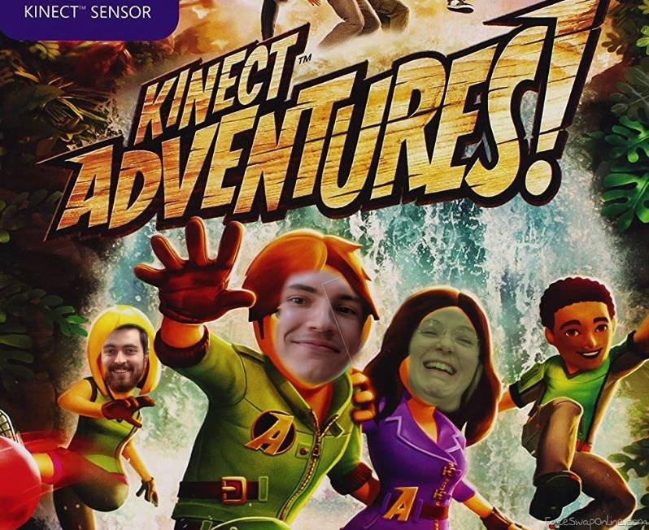
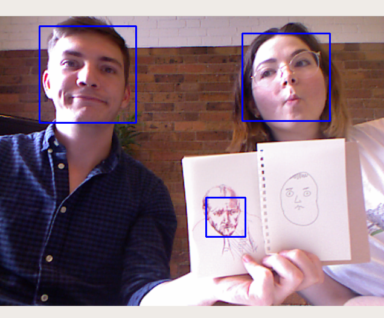

import { themes } from "mdx-deck";
export const theme = themes.hack;

import Temp from "./temp";
import { Head, Appear, Image, withDeck } from "mdx-deck"; // https://github.com/jxnblk/mdx-deck
import { Invert, Split } from "mdx-deck/layouts";
import { CodeSurfer } from "mdx-deck-code-surfer"; // https://elijahmanor.com/code-surfer/

# Connected Workplace

<Appear>
  <h3>More like</h3>
  <h1>Kinected Workplace</h1>
</Appear>
<Head>
  <title>Tanda 2019 hackathon</title>
</Head>

---

## The team



---

## The problem

<ul style={{ listStyle: "none" }}>
  <Appear>
    <li>Team temp is borken</li>
    <li>People lie about how they feel</li>
    <li>It's important to know how people are really doing</li>
  </Appear>
</ul>
---
# What will we need to fix this?

<ul style={{ listStyle: "none" }}>
  <Appear>
    <li>A $3 Xbox Kinect</li>
    <li>Serverless lambda</li>
    <li>Amazon credits for facial recognition</li>
  </Appear>
</ul>

```notes
lambda is not aws
```

---

## Face detection

## 

---

# Face to fahrenheit conversion

---

# Demo

<Temp></Temp>

---

# Thank you

### Sam Henry

### Robert Geroge

### Moria Quinn

---

<Image src="images/image1.jpg" />

```notes
Thanks for watching
```
